# IS601-851
# Mini-Project # 1 

## Apurva Patel

Git is a distributed version control system (DVCS). This is very commonly used for open source and commercial digital development. This system essentially allows every user to get access to every files and branches that have been made in the repository. It gives a user full access to all the changes that were made to the system and give him/her access to all history of the repository. In this system developers can work from basically anywhere in the world on a repository if they are the collaborators for that repository to make changes in it. This basically eliminates slower work environment by reducing unnecessary tasks. Docker is essentially a tool to design create, deploy and run applications. This helps many companies to maintain and store files in container. So, it not too difficult for a software developer to deploy an application. Developers can could store their files in the libraries to be used as in future reference. 
Automated testing is also a very important tool in the industry. This helps many firms across the globe for a faster and efficient testing operation for its software. There are less chances of human error when testing for a specific software is done automatically. 

Here's the list of Definitions:
1. [Repository](#definition1)
2. [Clone](#definition2)
3. [Fork](#definition3)
4. [Brach](#definition4)
5. [Commit](#definition5)
6. [Merge](#definition6)
7. [Checkout](#definition7)
8. [Push](#definition8)
9. [Pull](#definition9)
10. [Status](#definition10)
11. [GitHub](#definition11)
12. [cd](#definition12)
13. [MKdir](#definition13)
14. [cp](#definition14)
15. [Pwd](#definition15)
16. [mv](#definition16)
17. [rm](#definition17)
18. [history](#definition18)
19. [home directory](#definition19)
20. [File Path](#definition20)
21. [Using the tab key to complete the file paths](#definition21)

Git Commands & Terminology
1. **Repository**: A repository is the most basic element of GitHub. It is basically your folder for the entire project. This folder will contain all you document, project file and each of its revision history. The repository can be public, so multiple collaborators can work on the same project under one repository.

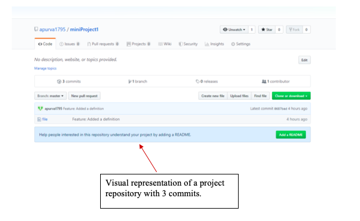
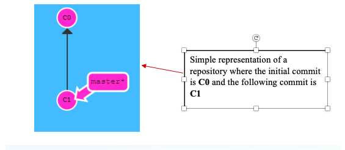

2. **Clone**:  A clone is a copy of the repository that is basically saved on your computer instead of on a website’s server. In this copy of your current repository you can edit files in your preferred editor and use Git to keep track of the changes made to the repository without having to being online.

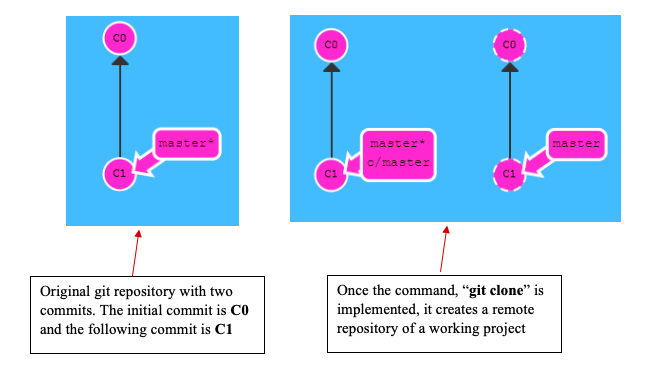

3. **Fork**: A fork is a personal copy of another user’s repository that is basically in your account. This allows you to easily make changes without affecting the original repository. Additionally, this is also attached to the original repository. So, you can essentially submit a pull request to the author/owner of the repository to make update with your new implemented changes.

4. **Branch**: A branch is essentially a parallel version of your repository. This is embedded within the repository but does not affect the primary master branch for the repository. When the changes that needs to be done or updated are completed on the branch, you can merge that branch into the master branch. This will basically publish all the changes to the master branch.

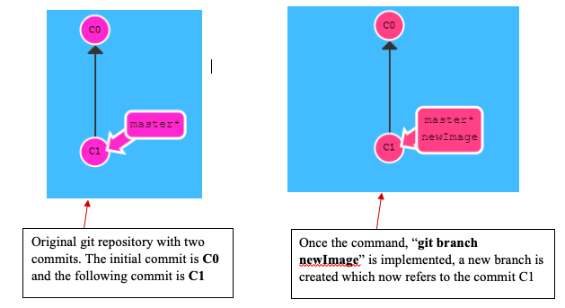

5. **Commit**: A commit is an individual change to a file. Every time you save in Git, it essentially created a unique ID for the file. It essentially records a snapshot of all the files in your directory. This allows the user/owner of the repository, to keep track of what changes were made in the file when and by who.  (Please see listed example below)

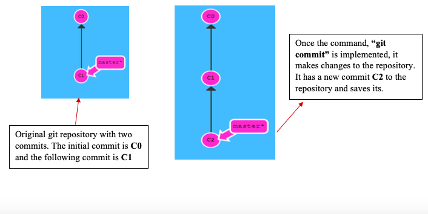

6. **Merge**: Merging essentially takes changes from one branch within the repository and applies them into another. This often takes place a pull request within the repository. This pull request can be done with the GitHub web interface if there are not conflicting changes on the branches. 
Merging bugFix branch into master branch

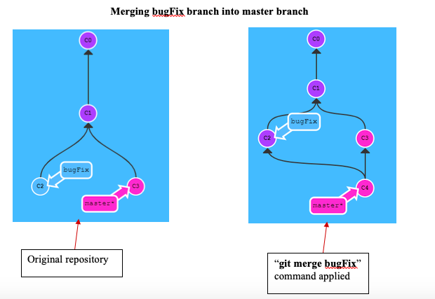
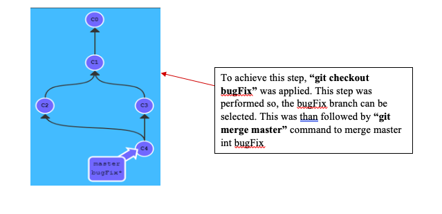

7. **Checkout**: The checkout command is used when you need to navigate between the created branches in the repository.

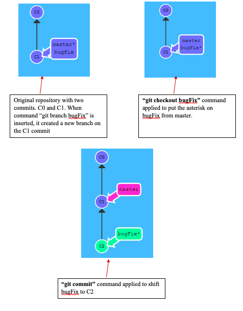

8. **Push**: Push generally refers to sending committed change to a remote repository. In this instance, if an owner/user made the changes to the repository locally, then he/she would need to push to changes. So, other collaborators on the repository can access them.

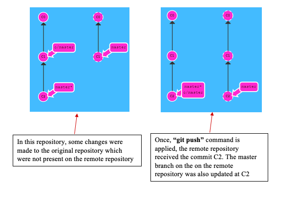

9. **Pull**: Pull generally refers to when you are fetching changes and merging them. This is usually helpful when someone has edited a file that multiple users are working on. Using pull in this instance will pull those changes to the local copy of the repository.  

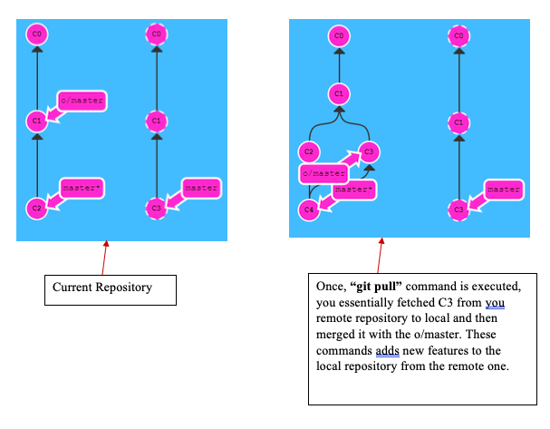

10. **Status**: This is essentially a type of status check on GitHub. These are used in GitHub to let the user know if the commits that he/she made is meets the condition that are set form that repository.  

11. **GitHub Flow**: This flow is essential a branch-based workflow. This flow has 6 steps to it. 

•	Create a branch
•	Add commits
•	Open pull request
•	Discuss & review code
•	Merge
•	Deploy

## Jenny George

12. **cd**:  Cd stands for “change directory”.  Cd switches you into the specific directly of your choosing as well as changing the working directory.  The cd command takes a directory name and then switches that to a different directory.  

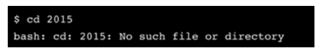

13. **Mkdir**:  mkdir is used to make a directory. We use it to create the directories that do not already exist.

14. **Cp**:  This command is used to copy files in a directory. We use this command so we will be able to create an exact replica of the file with a different name. 

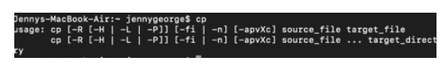

15. **Pwd**:  Pwd stands for print working directory. This command prints the working directory. Pwd is an environment which enables us to store the path. 

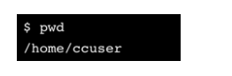

16. **mv**. mv stands for move. This command moves one file from once place to another. We can also use this command to rename a folder.

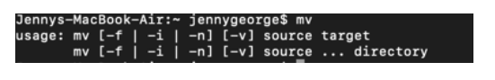

17. **rm**: rm stands for remove. This command is used to remove files from different directories in Linux. 

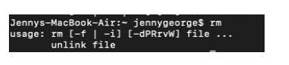

18. **history**: The history command shows a list all commands that were executed previously since the session had began. We can use this to view those commands and prevent certain commands from being visible. 

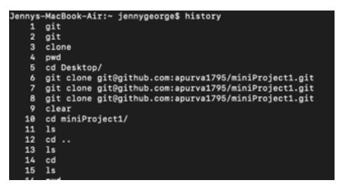

19. **home directory**: This command is used as a repository for the users personal files and programs. This directory is also called the login directory.

20. **File path**: This is a representation of the location of a file or folder on a computer system.

21. **Using the tab key to complete the file paths**: The tab key allows for a user to automatically view commands that have been previously used. With this command, users are able to type a few letters and press tab which will allow the rest of the file name to automatically fill. 
