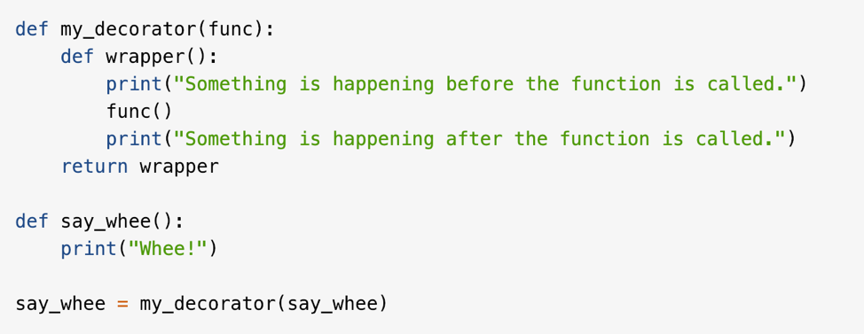

# IS601-851
# Mini-Project # 1 

## Apurva Patel

# Index

1. [Git, Docker, Automated Testing & Continuous Integration](#Section1)
2. [Git Commands & Terminology](#Section2)
3. [Basic Commands needed to to manage the file system](#section3)
4. [Change Log](#Section4)
5. [Mini Project 2] (#Section5)

**Git, Docker, Automated Testing & Continuous Integration**

Git is a distributed version control system (DVCS). This is very commonly used for open source and commercial digital development. This system essentially allows every user to get access to every files and branches that have been made in the repository. It gives a user full access to all the changes that were made to the system and give him/her access to all history of the repository. In this system developers can work from basically anywhere in the world on a repository if they are the collaborators for that repository to make changes in it. This basically eliminates slower work environment by reducing unnecessary tasks. Docker is essentially a tool to design create, deploy and run applications. This helps many companies to maintain and store files in container. So, it not too difficult for a software developer to deploy an application. Developers can could store their files in the libraries to be used as in future reference. 
Automated testing is also a very important tool in the industry. This helps many firms across the globe for a faster and efficient testing operation for its software. There are less chances of human error when testing for a specific software is done automatically. 

**Git Commands & Terminology**

1. **Repository**: A repository is the most basic element of GitHub. It is basically your folder for the entire project. This folder will contain all you document, project file and each of its revision history. The repository can be public, so multiple collaborators can work on the same project under one repository.

2.**Clone**:  A clone is a copy of the repository that is basically saved on your computer instead of on a website’s server. In this copy of your current repository you can edit files in your preferred editor and use Git to keep track of the changes made to the repository without having to being online.

3. **Fork**: A fork is a personal copy of another user’s repository that is basically in your account. This allows you to easily make changes without affecting the original repository. Additionally, this is also attached to the original repository. So, you can essentially submit a pull request to the author/owner of the repository to make update with your new implemented changes.

4. **Branch**: A branch is essentially a parallel version of your repository. This is embedded within the repository but does not affect the primary master branch for the repository. When the changes that needs to be done or updated are completed on the branch, you can merge that branch into the master branch. This will basically publish all the changes to the master branch.

5. **Commit**: A commit is an individual change to a file. Every time you save in Git, it essentially created a unique ID for the file. It essentially records a snapshot of all the files in your directory. This allows the user/owner of the repository, to keep track of what changes were made in the file when and by who.  (Please see listed example below)

6. **Merge**: Merging essentially takes changes from one branch within the repository and applies them into another. This often takes place a pull request within the repository. This pull request can be done with the GitHub web interface if there are not conflicting changes on the branches. 
Merging bugFix branch into master branch

7. **Checkout**: The checkout command is used when you need to navigate between the created branches in the repository.

8. **Push**: Push generally refers to sending committed change to a remote repository. In this instance, if an owner/user made the changes to the repository locally, then he/she would need to push to changes. So, other collaborators on the repository can access them.

9. **Pull**: Pull generally refers to when you are fetching changes and merging them. This is usually helpful when someone has edited a file that multiple users are working on. Using pull in this instance will pull those changes to the local copy of the repository.  

10. **Status**: This is essentially a type of status check on GitHub. These are used in GitHub to let the user know if the commits that he/she made is meets the condition that are set form that repository.  

11. **GitHub Flow**: This flow is essential a branch-based workflow. This flow has 6 steps to it. 

•	Create a branch
•	Add commits
•	Open pull request
•	Discuss & review code
•	Merge
•	Deploy

## Jenny George

**Basic Commands needed to to manage the file system**

1. **cd**:  Cd stands for “change directory”.  Cd switches you into the specific directly of your choosing as well as changing the working directory.  The cd command takes a directory name and then switches that to a different directory.  

2. **Mkdir**:  mkdir is used to make a directory. We use it to create the directories that do not already exist.

3. **Cp**:  This command is used to copy files in a directory. We use this command so we will be able to create an exact replica of the file with a different name. 

4. **Pwd**:  Pwd stands for print working directory. This command prints the working directory. Pwd is an environment which enables us to store the path. 

4. **mv**. mv stands for move. This command moves one file from once place to another. We can also use this command to rename a folder.

5. **rm**: rm stands for remove. This command is used to remove files from different directories in Linux. 

6. **history**: The history command shows a list all commands that were executed previously since the session had began. We can use this to view those commands and prevent certain commands from being visible. 

7. **home directory**: This command is used as a repository for the users personal files and programs. This directory is also called the login directory.

8. **File path**: This is a representation of the location of a file or folder on a computer system.

9. **Using the tab key to complete the file paths**: The tab key allows for a user to automatically view commands that have been previously used. With this command, users are able to type a few letters and press tab which will allow the rest of the file name to automatically fill. 

**Change Log**

|Date|	Details\|
|:---------|-------:|
|11/09/2019|	Apurva updated change log table and committed|
|11/09/2019|	Apurva updated change log table and committed|
|11/09/2019|	Apurva added a committed a change log table added|
|11/09/2019|	Apurva added a committed a change log trial|
|11/09/2019|	Apurva updated change log section on Readme.md and committed|
|11/09/2019|	Apurva updated Index and update readme.md files with internal links|
|10/27/19|	Apurva updated, headers, texts and added a single image to test and then added all the images to the Readme.md file. Committed all the imaged to the file|
|10/26/2019|	Apurva changed the filed extension for readme file to .md|
|10/26/2019|	Apurva added the initial readme file to the repository|
|10/10/2019|	Jenny added and committed definition for using tab keys to complete files|
|10/10/2019|	Jenny added and committed definition for command path file|
|10/10/2019|	Jenny added and committed definition of the command home directory|
|10/10/2019|	Jenny added and committed definition of the command history|
|10/10/2019|	Jenny added and committed definition of the command rm|
|10/10/2019|	Jenny added and committed definition of the command mv|	 
|10/10/2019|	Jenny added and committed definition of the command pwd|
|10/10/2019|	Jenny added and committed definition of the command cp|
|10/10/2019|	Jenny added and committed definition of the command mkdir|
|10/10/2019|	Jenny added and committed definition of the command cd|
|10/10/2019|	Jenny added and committed definition|
|10/09/2019|	Apurva added a fix, added the answer to the primary question and committed|
|10/09/2019|	Apurva added and committed definition of the term Github flow|
|10/09/2019|	Apurva added and committed definition of the term status|
|10/09/2019|	Apurva added and committed definition of the term pull|
|10/09/2019|	Apurva added and committed definition of the term push|
|10/09/2019|	Apurva added and committed definition of the term checkout|
|10/09/2019|	Apurva added and committed definition of the term merge|
|10/09/2019|	Apurva added and committed definition of the term commit|
|10/09/2019|	Apurva added and committed definition of the term branch|
|10/09/2019|	Apurva added and committed definition of the term fork|
|10/09/2019|	Apurva added and committed definition of the term clone|
|10/09/2019|	Apurva added and committed definition of the term Repository|
|10/08/2019|	Apurva added and committed test added definition|
|10/08/2019|	Apurva performed the initial commit|

**Mini Project 2**

1. **How Python uses Indentation to control Flow**: Indentation used in python is used to signify and delimit a scope. One or two white space characters are sufficient to serve as an indentation. There must be a uniform level of indentation associated with each block.

 

2. **Don't Repeat Yourself**: The Don’t Repeat Yourself principle states that there should be no duplication through abstraction. It is also good practice to not have unnecessary code to extend code and maintain software. 

3. **Design Patterns from Gang of Four**: Most programmers come to the same certain design issue when implementing and creating code. Due to this there were design patterns that were created later called the gang of four. The different design patterns are creational patterns, structural patterns, and behavioral patterns. 

4. **Class**: A class is a guide to create an object and they are created by the keyword class. 

5. **Object**: An object is an instance of a class and is created usually using the constructor of the class. 

6. **Static**: The word static means the members are associated on a class level. They are not associated on an instance level and are not instantiated.

7. **Property / Attribute**: Attributes in Python are used to associate and describe different variables. Different associations could be getters, setters, and delete methods along with the property function. 

8. **Method**: A method belongs to an object in Python. Objects are also capable of having methods. Certain types of objects are insert, remove, and sort. Different types of instance objects vary upon its class.

9. **Exception**: An exception in Python disrupts the flow of the program as a whole. When an error occurs in Python an exception is thrown to keep the balance of the program in a situation where it is unable to handle the error. 

10. **Unit Test**: Unit testing is general level of software testing involved with testing small pieces or “units” of code to ensure for functionality and proper testing practices. This is also referred to as white box testing. 

11. **Constructor**: A constructor instantiates an object using various definitions found in a class. The constructor assigns values to any instance variable that the object will need to perform its designated tasks. 

12. **Factory**: Factory method requires implementing a creational design pattern which solves different problems associated with objects without specifying their concrete class.

 

13. **Decorator**: A decorator allows a user to modify their code and implementing more to its functionality rather than modifying its structure. They can be called before the definition that would need to be modified.

14. **Extend Class**: There is an aspect that allows you to extend a class that is already existing. This is needed to add new functionality or new meaning to classes that already exist. 

15. **CSV Files**: CSV file can be used during unit testing and contains a certain amount of data that can be passed through the program as inputs to test if the program is outputting the correct functionality as expected. It is implemented using reader object. 

16. **Reading Files**: The reading file is used to read data from an excel sheet or other file. In python, the program can be written to read the data from the reading files but no manipulation or editing can occur. 

